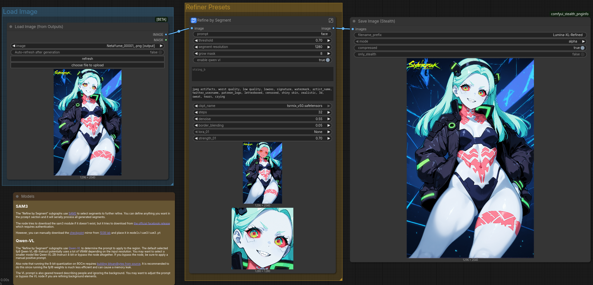
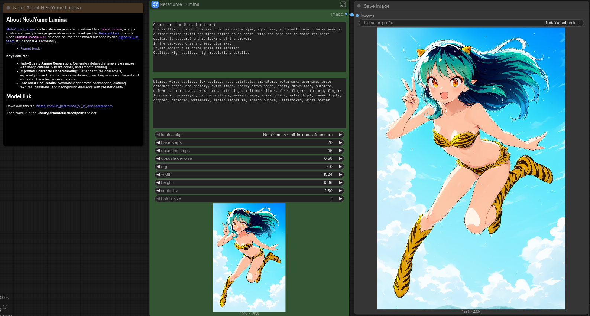
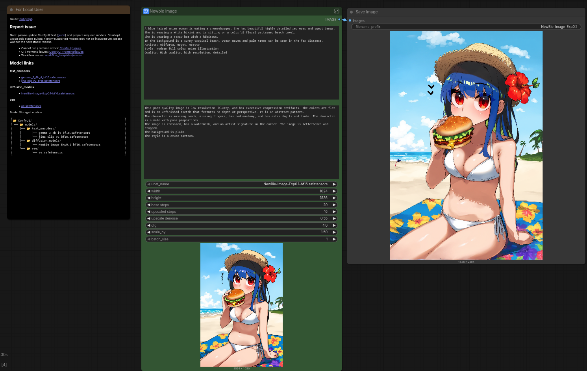

# comfy-workflows
Custom workflows for ComfyUI

## SAM3 Refine by Segment

Uses [SAM3]() to make an img2img mask and uses [Qwen-VL](https://github.com/1038lab/ComfyUI-QwenVL) to automatically generate a prompt describing the masked segment. Set up to use SDXL img2img but can be adapted for any model.

## NetaYume Lumina

Download the latest [NetaYume Lumina](https://huggingface.co/duongve/NetaYume-Lumina-Image-2.0) all-in-one and put it in `models/checkpoints`

`netayume-t2i.json` is the basic workflow and `netayume-sdxl-t2i.json` uses SDXL img2img as a final refiner pass with automated prompt conversion using [LLM Party](https://github.com/heshengtao/comfyui_LLM_party)

## NewBie

Download the latest [NewBie](https://huggingface.co/NewBie-AI/NewBie-image-Exp0.1), place the diffuser model in `models/diffusion_models` and the text encoders in `models/text_encoders`

`newbieimage-t2i.json` is the basic workflow and `newbieimage-sdxl-t2i.json` uses SDXL img2img as a final refiner pass with automated prompt conversion using [LLM Party](https://github.com/heshengtao/comfyui_LLM_party)