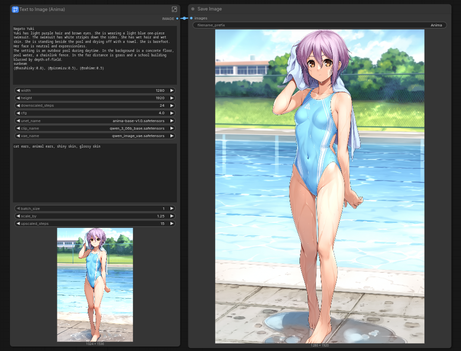
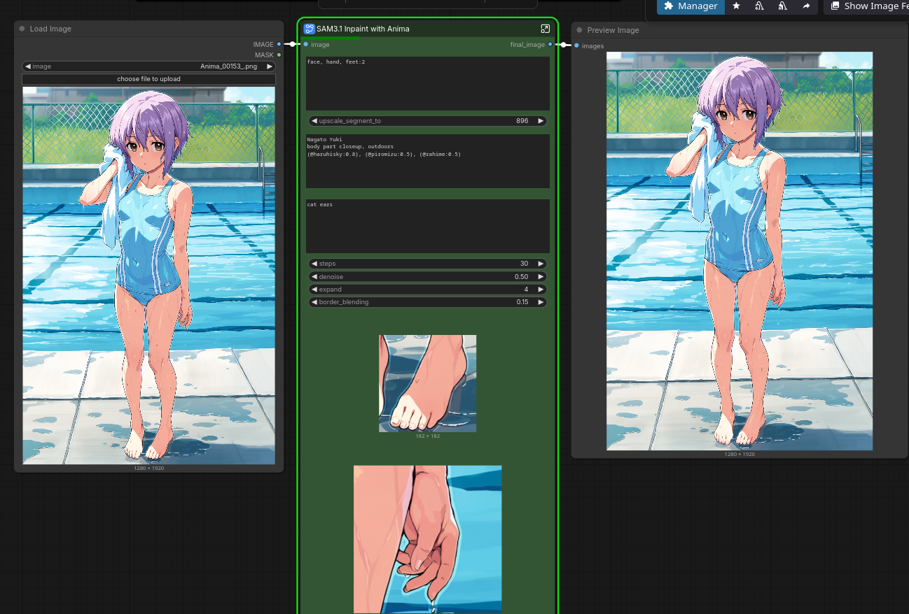
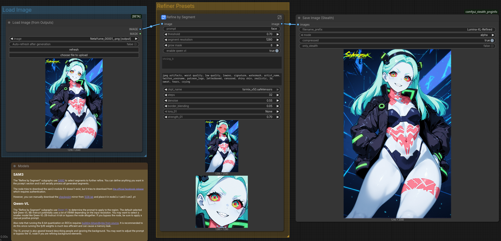
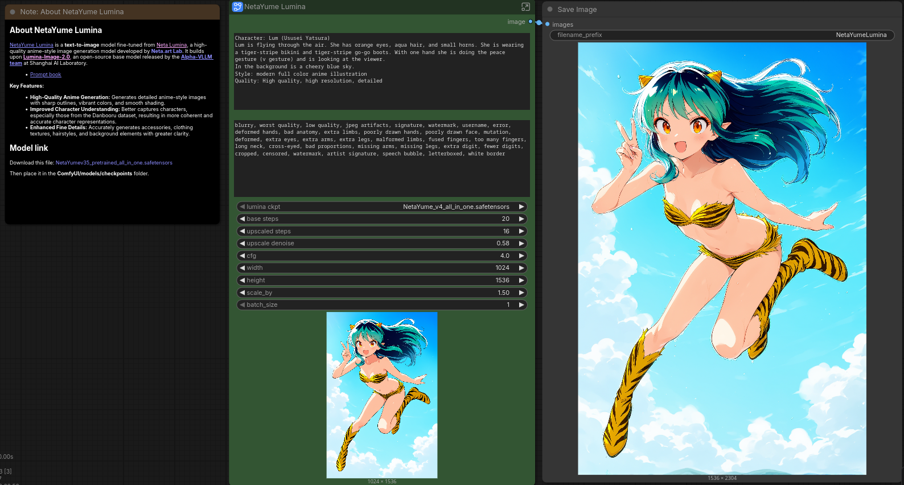
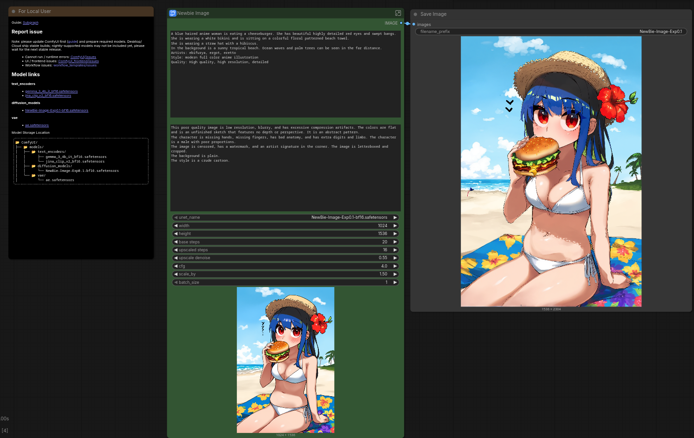

# comfy-workflows
Custom workflows for ComfyUI

## Anima

Two workflows, basic and upscale. Anima can handle native high resolution generation but the base model is slow without a turbo lora. The goal of the upscale workflow is to shave off time by doing most of the steps at lower resolution.
Note that the upscale workflow divides the target `width` and `height` by the `scale_by` value, then upscales it by that amount for the final pass. It is recommended, but not required, to use resolution and scale values that divide into whole numbers.\
Download the latest [Anima](https://huggingface.co/circlestone-labs/Anima) and put the files in the appropriate directories.\
Side note: [Qwen3 0.6B Abliterated](https://huggingface.co/ibrahimkettaneh/Qwen3-0.6B-abliterated) works as a text encoder, but I don't know if there's any benefit.

## SAM3 Inpainting

### Anima (Mostly) Native Workflow

Uses native SAM3 node to detect segments. Uses Anima to inpaint, but can be adapted to load any model. Segments are individually upscaled and processed before being downscaled and blended with the original input. This workflow uses as many native nodes as possible, but needs a few utility nodes to loop through multiple masks.

### Deprecated Workflow

Uses [SAM3](https://github.com/wouterverweirder/comfyui_sam3) 3rd party node to make an img2img mask and uses [Qwen-VL](https://github.com/1038lab/ComfyUI-QwenVL) to automatically generate a prompt describing the masked segment. Set up to use SDXL img2img but can be adapted for any model.

## NetaYume Lumina

Download the latest [NetaYume Lumina](https://huggingface.co/duongve/NetaYume-Lumina-Image-2.0) all-in-one and put it in `models/checkpoints`

`netayume-t2i.json` is the basic workflow and `netayume-sdxl-t2i.json` uses SDXL img2img as a final refiner pass with automated prompt conversion using [LLM Party](https://github.com/heshengtao/comfyui_LLM_party)

## NewBie

Download the latest [NewBie](https://huggingface.co/NewBie-AI/NewBie-image-Exp0.1), place the diffuser model in `models/diffusion_models` and the text encoders in `models/text_encoders`

`newbieimage-t2i.json` is the basic workflow and `newbieimage-sdxl-t2i.json` uses SDXL img2img as a final refiner pass with automated prompt conversion using [LLM Party](https://github.com/heshengtao/comfyui_LLM_party)